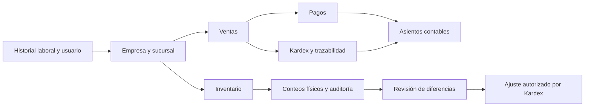

# Guías de módulos del SIA

Revisión del código: **7 de septiembre de 2026**.

Estas guías describen el comportamiento implementado. Las opciones visibles dependen de los permisos del usuario y del contexto empresarial configurado. Las referencias técnicas permiten localizar dónde mantener cada flujo.

| Guía | Contenido |
| --- | --- |
| [Ventas](ventas.md) | Clientes, contactos móviles, cotizaciones, pedidos, facturas, pagos y fechas. |
| [Contabilidad](contabilidad.md) | Asientos, comprobaciones, períodos, saldos, integración y regularización. |
| [Inventario](inventario.md) | Artículos, stock, reservas, Kardex, costos, series y lotes. |
| [Inventarios físicos](inventarios-fisicos.md) | Programación, conteo, escáner, avance, auditoría, cierre e informes. |
| [RRHH](rrhh.md) | Empleados, historial laboral, perfil, horarios, asignaciones y asistencias. |

## Orden recomendado de configuración

1. Registrar empresa y sucursales; cargar el logo de cada empresa si se usarán reportes de inventario.
2. Registrar empleados, historial laboral activo, correo corporativo y permisos de usuarios.
3. Configurar almacenes, unidades, grupos, fabricantes, artículos y precios; registrar existencias por Kardex.
4. Configurar cuentas contables y revisar los períodos antes de registrar operaciones.
5. Registrar clientes y operar Ventas. Consultar Stock antes de reservar o entregar.
6. Programar inventarios físicos para verificar las existencias y documentar sus diferencias.

## Relación entre módulos

El cierre de un inventario físico no genera automáticamente el ajuste indicado en el diagrama: se registra por separado en Kardex.

## Fechas y auditoría

La fecha de una operación puede ser anterior a la fecha en que se registra. `created_at`, `updated_at` y la autorización documentan la actividad del sistema; no sustituyen la fecha comercial o contable. La correspondencia exacta para ventas está en [Ventas: fechas](ventas.md#fechas-de-la-operación).

Las reglas nuevas no reescriben asientos históricos confirmados. La revisión de datos anteriores requiere identificar documentos, saldos, períodos y movimientos asociados antes de corregirlos.

## Mantenimiento de las guías

Cuando cambien estados, permisos, fechas, formularios o efectos sobre otros módulos, actualizar la guía correspondiente y sus referencias. Las pruebas mencionadas son comandos reproducibles; no significan que se haya ejecutado toda la suite ni que se hayan comprobado cámaras, dispositivos biométricos o cuentas externas.

Volver al [README del proyecto](../README.md).

## Actualizaciones

- [Cambios de septiembre de 2026](actualizacion-2026-09-10.md): Filament 4, tema nativo, migraciones e integridad de operaciones.
